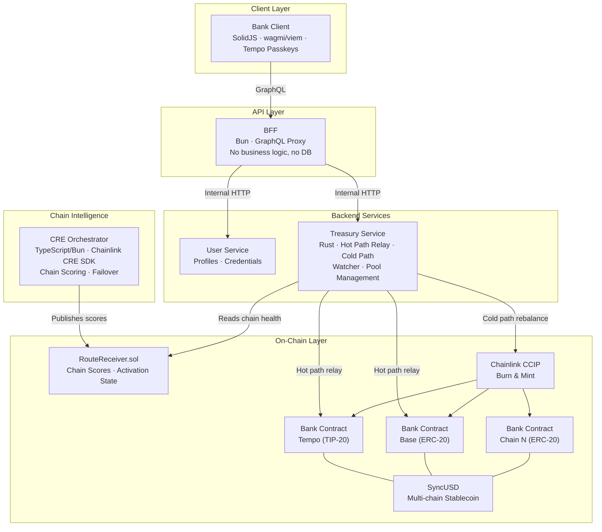

# web3Bank

> A Web3-native banking experience built on stablecoins, passkey authentication, and cross-chain load balancing.

---

## Vision

web3Bank delivers a traditional **banking UX** powered entirely by on-chain infrastructure. Users interact with a familiar interface — balances, transfers, statements — without needing to understand wallets, gas fees, or chain selection. Under the hood:

- **Authentication** is passkey-only — no seed phrases, no passwords. Uses Tempo's native EIP-2718 passkey transaction type.
- **Funds** are held in **SyncUSD**, a custom stablecoin backed 1:1 by USDC, deployed across multiple chains.
- **Chain routing** is load-balanced transparently via the CRE Route Orchestrator. If one chain degrades, funds and transactions are automatically routed elsewhere — users never notice.
- **Transfers** are instant across chains via pool-to-pool hot path relay. Background CCIP rebalancing keeps pools funded.

---

## Architecture



---

## Core Components

| Component | Description | Runtime |
|-----------|-------------|---------|
| **Bank Client** (`apps/bank-client`) | SolidJS frontend. Passkey auth via wagmi/viem, Tempo native EIP-2718 transactions. | SolidStart |
| **BFF** | Thin GraphQL proxy. Forwards requests to backend services, manages JWT sessions. No database, no business logic. | Bun |
| **User Service** | User profiles, passkey credential-to-address mapping, account state. | Rust (tonic gRPC) |
| **Treasury Service** | Hot path relay, cold path CCIP rebalancing, pool depth management, watcher (fraud detection). | Rust |
| **CRE Orchestrator** | Scores chains on fee, latency, reliability, liquidity. Publishes rankings to `RouteReceiver.sol`. Separate repo, already ~80% complete. | TypeScript/Bun |
| **SyncUSD** | Custom stablecoin backed 1:1 by USDC. TIP-20 on Tempo, ERC-20 on other chains. CCIP burn-and-mint for cross-chain movement. | Solidity |
| **Bank Contract** | Liquidity pool per chain. Deposit/withdraw (USDC ↔ SyncUSD), hot path transfers. UUPS upgradeable, pausable. | Solidity |
| **RouteReceiver** | On-chain registry of chain health scores and activation states. Written by CRE, read by Treasury. | Solidity |

---

## Cross-Chain Strategy

| Concern | Approach |
|---------|----------|
| **Hot Path (Instant Transfers)** | Pool-to-pool relay via Treasury Service. No CCIP delay. |
| **Cold Path (Rebalancing)** | Batched CCIP burn-and-mint when pools become imbalanced. |
| **Chain Scoring** | CRE Orchestrator: Fee (35%), Latency (30%), Reliability (25%), Liquidity (10%) |
| **Failover** | CRE drops degraded chains from active set. Treasury stops routing to them. |
| **Security** | Watcher module cross-verifies every hot path release. Pauses contracts on mismatch. |
| **User Impact** | Zero — chain selection is invisible to the end user. |

---

## Monorepo Structure

```
web3Bank/
├── apps/
│   └── bank-client/          # SolidJS frontend
├── packages/
│   ├── ui/                   # Shared UI component library
│   ├── eslint-config/        # Shared ESLint configuration
│   └── tailwind-config/      # Shared Tailwind v4 configuration
├── openspec/                 # Authoritative specifications
│   ├── config.yaml           # Project context (tech stack, conventions)
│   └── specs/                # One spec per capability
│       ├── auth/                          # Passkey auth & signing
│       ├── user-identity/                 # Profile & credential mapping
│       ├── banking-ledger/                # SyncUSD, deposit, withdraw
│       ├── cross-chain-routing/           # Hot path, cold path, watcher
│       ├── chain-health-orchestration/    # CRE scoring & RouteReceiver
│       └── service-architecture/          # Service boundaries & contract patterns
├── docs/
│   └── user-journey.md       # End-to-end narrative walkthrough
├── tasks/                    # Implementation task breakdowns
└── [future]
    ├── contracts/            # Solidity: SyncUSD, Bank Contract (Foundry)
    └── services/
        ├── bff/              # GraphQL proxy (Bun)
        ├── treasury/         # Hot path, cold path, watcher (Rust)
        └── user-service/     # Profiles, credentials
```

---

## Open Items (Deferred)

> Authoritative specs live in `openspec/specs/`. The items below are tracked but not yet decided — they will become OpenSpec change proposals when worked on, not direct spec edits.

- [ ] Account recovery strategy (social recovery, backup passkeys, time-delayed)
- [ ] Revenue/fee model (spread, transfer fees, yield on reserves)
- [ ] Regulatory considerations (KYC/AML — deferred since testnet only)
- [ ] Observability stack (metrics, alerting, dashboards)
- [ ] User Service runtime decision (Rust or Bun)

---

*This document evolves as the project grows. Last updated: 2026-03-15.*
