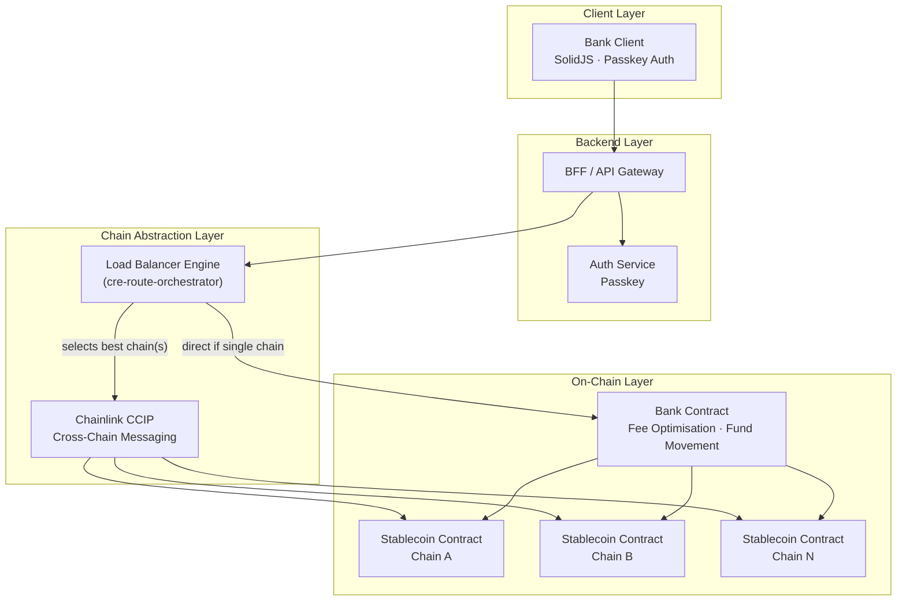

# web3Bank

> A Web3-native banking experience built on stablecoins, passkey authentication, and cross-chain load balancing.

---

## Vision

web3Bank delivers a traditional **banking UX** powered entirely by on-chain infrastructure. Users interact with a familiar interface — balances, transfers, statements — without needing to understand wallets, gas fees, or chain selection. Under the hood:

- **Authentication** is passkey-only — no seed phrases, no passwords.
- **Funds** are held in a **custom stablecoin** designed for resilience across chains.
- **Chain routing** is load-balanced transparently: if one chain degrades, user funds and transactions are automatically routed elsewhere — users never notice.
- **Fee optimisation** is handled by bank contracts that batch and move funds to minimise on-chain costs.

---

## Architecture



---

## Core Components

| Component | Description |
|-----------|-------------|
| **Bank Client** (`apps/bank-client`) | SolidJS front-end providing the banking UX. Passkey-based login. |
| **BFF / API Gateway** (`apps/bff`) | Backend-for-frontend mediating between the client and on-chain services. |
| **Auth Service** | Passkey registration and assertion. |
| **Load Balancer Engine** | Scores and ranks supported chains in real-time (fees, latency, reliability, liquidity). See `cre-route-orchestrator`. |
| **Custom Stablecoin** | ERC-20 stablecoin deployed across multiple chains with cross-chain load balancing. |
| **Bank Contract** | Smart contracts managing fund movements, batching operations, and coordinating cross-chain transfers via CCIP. |

---

## Cross-Chain Strategy

| Concern | Approach |
|---------|----------|
| **Messaging** | Chainlink CCIP for cross-chain token transfers and contract calls |
| **Chain Selection** | cre-route-orchestrator scoring engine (fee, latency, reliability, liquidity) |
| **Failover** | If primary chain degrades, traffic is re-routed transparently |
| **User Impact** | Zero — chain selection is invisible to the end user |

---

## Monorepo Structure

```
web3Bank/
├── apps/
│   ├── bank-client/          # SolidJS front-end
│   └── bff/                  # Backend-for-frontend
├── packages/
│   ├── ui/                   # Shared UI component library
│   ├── eslint-config/        # Shared ESLint configuration
│   └── tailwind-config/      # Shared Tailwind v4 configuration
├── architecture/             # Decision records for each topic
└── [future packages]
    ├── contracts/            # Stablecoin + Bank smart contracts
    ├── shared-types/         # Shared TypeScript types / Zod schemas
    └── config/               # Runtime configuration
```

---

## Open Questions & Decisions

> Tracked here as the project evolves. Decision records live in `architecture/`.

- [ ] Stablecoin peg mechanism
- [ ] Chain set for launch
- [ ] Passkey + account abstraction approach
- [ ] Cross-chain mint/burn vs lock/unlock
- [ ] Fee model (paymaster / relayer / bundled)
- [ ] cre-route-orchestrator integration strategy
- [ ] Regulatory considerations

---

*This document evolves as the project grows. Last updated: 2026-03-13.*
