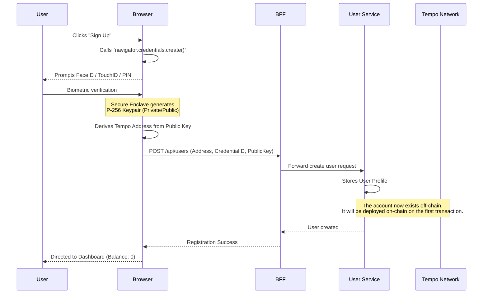
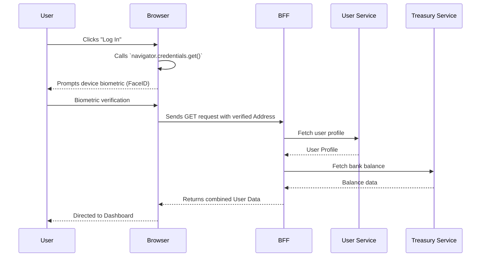
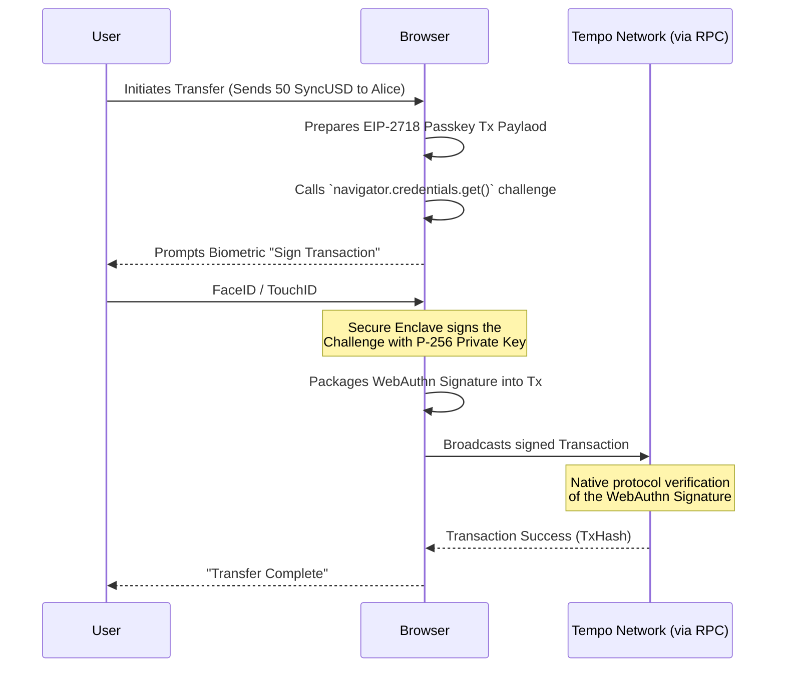

# Authentication

> **Status:** ✅ Decided

## Decision

Users authenticate exclusively via **passkeys** using **Tempo Native Passkeys**. No passwords, no seed phrases.

We have decided to use **Tempo's native EIP-2718 passkey transaction type** (via the `wagmi` `webAuthn` connector).

### Rationale

- **Native to the Chain:** All user operations (deposits, transfers, withdrawals) will occur on the Tempo blockchain via our Bank Contracts.
- **Domain-Bound accounts:** WebAuthn credentials will be bound to the web3Bank domain, providing a secure, passwordless authentication experience using device biometrics (Face ID, Touch ID).
- **Reduced Complexity:** Since the user's balances on other chains are handled transparently by the backend treasury system (via CCIP pool rebalancing), the user only ever needs to interact directly with the Tempo chain. Thus, we do not need a complex cross-chain wallet solution for the end user.
- **Protocol-level Support:** Tempo supports passkeys natively at the protocol level, allowing us to leverage fee sponsorship (paying gas in stablecoins on behalf of the user) without relying on centralized MPC wallet infrastructure.

---

## Authentication Flows

Because we are using Tempo's native passkeys, the "authentication" process is fundamentally tied to **key generation** and **transaction signing** rather than a traditional session cookie or JWT approach. 

The user's device (Secure Enclave / TPM) holds the private key (P-256 curve), and the Tempo blockchain directly verifies the WebAuthn signatures. 

### 1. Registration (Account Creation)

When a new user signs up, the browser generates a new WebAuthn credential bound to the `web3Bank` domain. The public key is then used to derive the user's Tempo address.

### 2. Login (Device Recognition)

Since passkeys generate deterministic addresses based on the credential, "logging in" simply means asking the browser if a credential for this domain exists, and using it to verify the user's address.

### 3. Transaction Signing (The Core Interaction)

When the user performs an action (e.g., Transfer $50 to Alice), the action is signed directly by the Passkey and submitted as a native Tempo EIP-2718 transaction.

### Key Technical Considerations

1. **Recovery:** Passkeys are synced via Apple iCloud Keychain / Google Password Manager. If a user loses their device, they can recover the passkey on a new device signed into the same cloud account. If they lose their cloud account, funds are lost (unless we build a social recovery or multi-sig recovery contract on top of the native account).
2. **Device Portability:** Users can only transact on devices that have access to that specific passkey. 
3. **Session State:** The UI can maintain a "logged-in" visual state via standard sessions/JWTs to avoid asking for FaceID on every page load, but *any actual mutation of funds* will trigger a biometric passkey prompt to sign the on-chain transaction.
